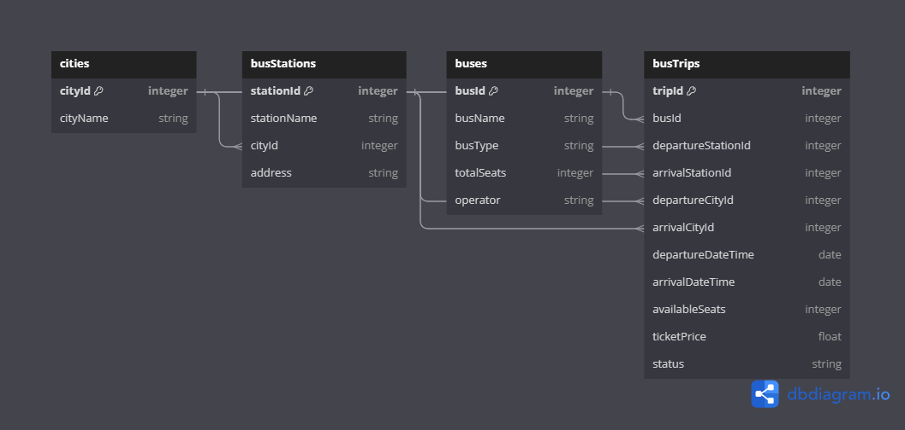

#  Welcome to Bus_Search_Service

## Project Setup 
1. clone the project on your local machine 
2. Execute ` npm install ` on the same path as of your root directory of the downloaded project  
3. Create a new `.env ` file in the root directory and add the following environment variable 
      - `PORT=3000`
4. Inside the `src/config` folder create a new file `config.json` and add the following piece of json 

```

{
  "development": {
    "username": <YOUR_DB_NAME>,
    "password": <YOUR_DB_PASS>,
    "database": "Booking_Search_DB_DEV",
    "host": "127.0.0.1",
    "dialect": "mysql"
  }
}

```
5. Once you have addded your db config as listed above , go to the src folder from your terminal 
execute 
    - `npx sequelize db:create`
    - `npx sequelize db:migrate` 

## DB Design
1. The database will have following tables 
    -  Bus table 
    -  BusTrips table 
    -  BusStation 
    -  City table 
2. A Bus trip belongs to an bus but one bus can be used in multiple Bus trips 
3. A city has many Bus stations but one Bus station belongs to a city 
4. One Bus station can have many flights but one flight of particular id can belong to only one airport 

## Tables

### Bus

```json
{
  "attributes": {
    "BusID": "Primary Key",
    "BusName": "String",
    "BusType": "String",
    "TotalSeats": "Integer",
    "Operator": "String",
  }
}
 
```
### BusTrips

```json

  "BusTrips": {
    "attributes": {
      "TripID": "Primary Key",
      "BusID": "Foreign Key referencing Bus",
      "DepartureStationID": "Foreign Key referencing BusStation",
      "ArrivalStationID": "Foreign Key referencing BusStation", 
      "DepartureCityId": "Foreign Key referencing City",
      "ArrivalCityId": "Foreign Key referencing City",
      "DepartureDateTime": "Date",
      "ArrivalDateTime": "Date",
      "AvailableSeats": "Integer",
      "TicketPrice": "Float",
      "Status": "String (e.g., Active, Inactive)"
    }
  },

```
### BusStation 

```json

  "BusStation": {
    "attributes": {
      "StationID": "Primary Key",
      "StationName": "String",
      "CityID": "Foreign Key referencing City",
      "Address": "String",
    }
  },

```

### City 

```json

  "City": {
    "attributes": {
      "CityID": "Primary Key",
      "CityName": "String"
    }
  }



## Model Relationships:

1. Each `City` can have multiple `BusStations` (one-to-many relationship).
2. Each `BusStation` can have multiple `Buses` (one-to-many relationship).
3. Each `Bus` can have multiple `BusTrips` (one-to-many relationship).
4. Each `BusTrip` has a departure `City` (many-to-one relationship).
5. Each `BusTrip` has a departure `BusStation` (many-to-one relationship).
6. Each `BusTrip` references a specific `Bus` (many-to-one relationship).
7. Each `BusTrip` has an arrival `City` (many-to-one relationship).
8. Each `BusTrip` has an arrival `BusStation` (many-to-one relationship).


